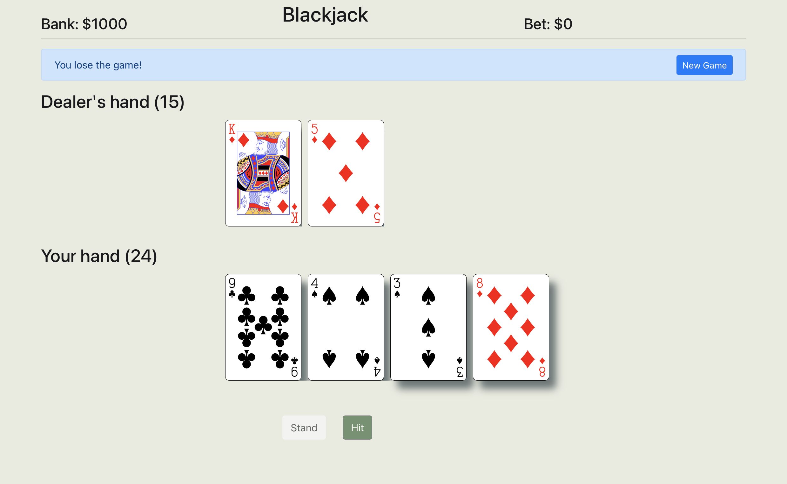

# Blackjack

Client: 

Server: 

## Tech used

- [React](https://reactjs.org) on the frontend
  - [React-bootstrap](https://react-bootstrap.github.io) for UI components
  - [Axios](https://axios-http.com) for making promise based HTTP requests
  - Using function components and hooks
- [Express](http://expressjs.com) on the backend
  - [Sequelize](https://sequelize.org) as the ORM
  - Manages instances of Blackjack for multiple users
- [MySQL](https://www.mysql.com) for a database
  - Players table stores player information (game state data, money, hands, etc)

## Architecture

The game is server-authoritative, all requests from the client are essentially inputs to an instance of the game, attatched to a certain game "ID". The server then proceses the input and sends back the updated game state to be displayed by the client, this means that much of the validation can happen server-side and players can't cheat.

I wanted to make the game of Blackjack first so thats what I started with, the server is simply a manager for instances of Blackjack games. It manages multiple sessions, creating IDs to be sent to the client, and saving state to the database. A game of Blackjack consists of a Blackjack object, which contains information about the game state including Decks of Cards. I wanted to try to encasuplate as much behavior as I could into separate components.

The server then is just a manager of Blackjack instances. It holds a map of UUIDs to instances of Blackjack. When the client connects it checks to see if an ID was sent and whether it was valid, if the ID was not it will instantiate a new game of Blackjack, save it to the database using the Player model and send back the instance to the client. The client then saves the ID for this instance into local storage so that it can be used for all future requests. This allows for multiple sessions to be run at the same time, it also allows the player to leave their session and pick back up whenever. For example if the server has restarted between the time the player left and came back, when their ID is sent to the server it will find a matching row in the Players table and instantiate a new game of Blackjack using that ID if it does not already exist.

The client is written in React and simply stores the ID received from the server and sends it alongside every request. It displays UI that is relevant to the current game state and allows the user to send inputs.

The game is essentially a Blackjack class that simulates the game of Blackjack for 1 given user.

As someone who's career has been primarily frontend focused so far, learning how to write a backend service from scratch using Express was a fun challenge, and I look forward to learning more.

For deployment I used Dockerfiles and docker-compose, the client is served using the Webpack development server for testing. However in a full production environment I'd want to use something like nginx and serve the results of `npm build`.

## Setting up a local environment

The entire application can be run using docker-compose

Run `docker-compose up` when in the root directory and the game will launch the database, the server, and then the client.

If you encounter any issues you can manually run each service at a time by running

`docker-compose up db`

then

`docker-compose up server`

and finally

`docker-compose up client`

The server will crash if it cannot connect to the database, however it will keep restarting until it can.

## Contact

Mohsin Qureshi - mohsinqureshi51@gmail.com
